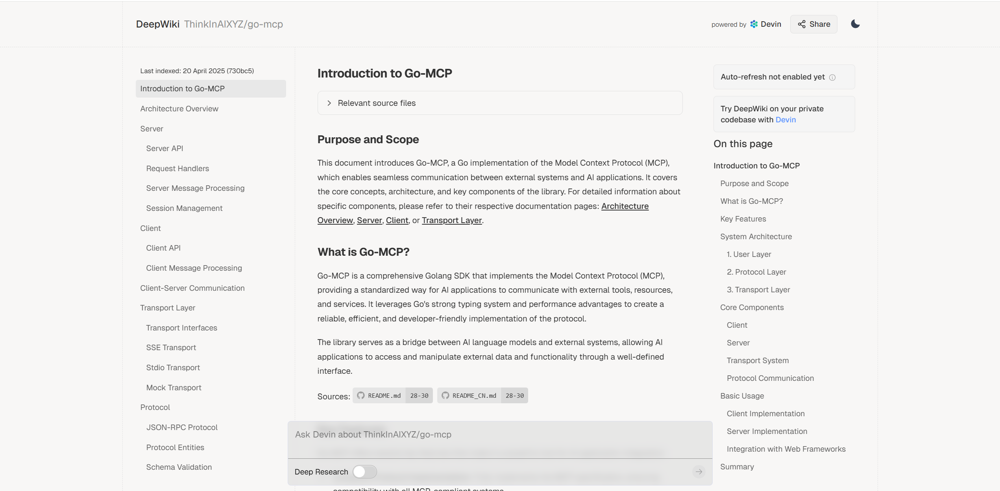
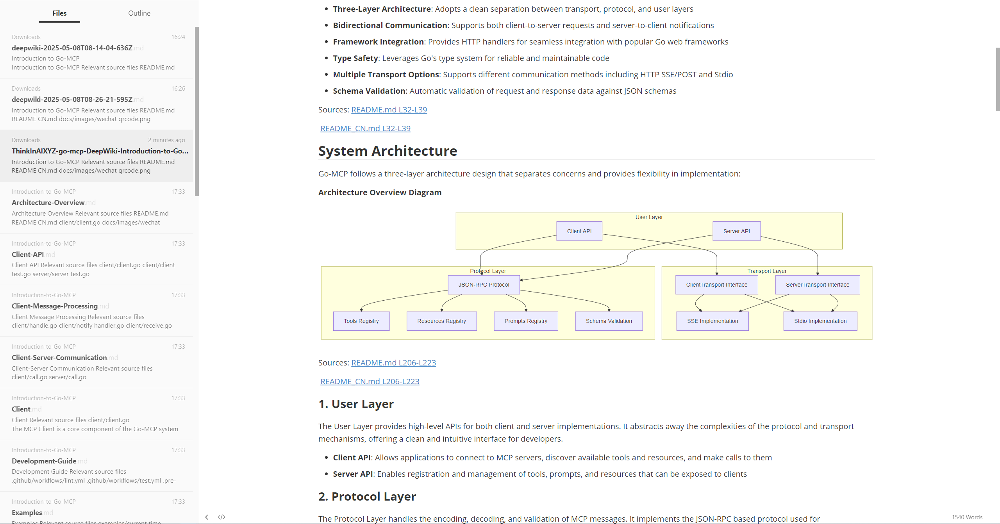

# DeepWiki Webpage Convert To Markdown Extension

[中文文档](./README.zh-CN.md)

## Purpose

I want to save the code documentation from the GitHub repository of the DeepWiki website, so that I can modify it locally and then rewrite it into my own blog, even adding some of my own insights. For example, open ThinkInAIXYZ/go-mcp. The content is as follows:

The conversion to Markdown format is as follows:

## Features

1. Convert single page content from DeepWiki website to Markdown format
2. One-click batch conversion and download of all subpages of a document (packaged as a ZIP file)
3. The UML diagrams in the document will also be saved.

## How to Use

1. Single Page Conversion:
   - Open any page on DeepWiki, such as：[ThinkInAIXYZ/go-mcp](https://deepwiki.com/ThinkInAIXYZ/go-mcp)
   - Click the extension icon
   - Click the "Convert & Download Current Page" button
   - The page will be converted and a download dialog will appear

2. Batch Download All Pages:
   - Open a DeepWiki page, such as：[ThinkInAIXYZ/go-mcp](https://deepwiki.com/ThinkInAIXYZ/go-mcp)
   - Click the extension icon
   - Click the "Batch Convert & Download All Pages" button
   - The extension will automatically convert all page content and package them into a ZIP file for download

## Notes

- During batch conversion, all pages will be visited sequentially, please be patient
- All files will be packaged into a ZIP file named after the current page title
- The ZIP file contains a "README.md" file listing links to all documents

## Roadmap

Future planned features include:

- Automatic translation to other languages before conversion
- Enhanced local storage options
- Integration with cloud services:
  - Google Drive
  - Feishu/Lark Docs
  - Microsoft OneDrive
  - Notion
  - And more...

Feel free to contribute or suggest new features by creating an issue or pull request.

